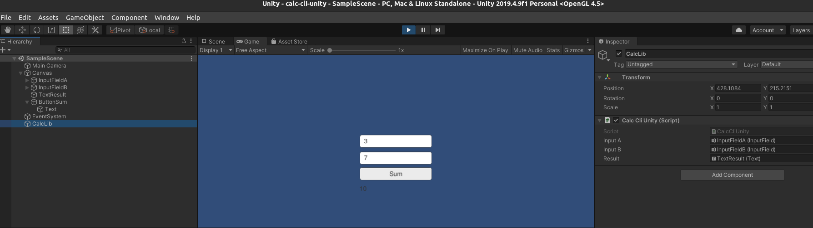
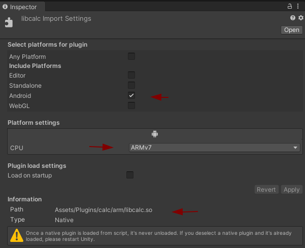
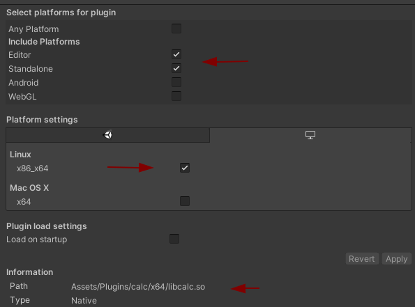

# unity-shared-library

Using shared library inside Unity game

# Req

* Dotnet 3+
* Unity 2019+


Ubuntu

```bash
sudo apt update && \
sudo apt install -y apt-transport-https dotnet-sdk-3.1 nuget
```

# Steps

1. Library


* C#

```bash
cd calc-lib
dotnet build
```

[Calculation.cs](calc-lib/Calculation.cs)

```csharp
using System;

namespace calculation
{
    public class Calculate
    {
        public int Sum(int a, int b){
            return a+b;
        }
    }
}
```

* C

```bash
cd calc-lib-c
make
```

[calc.h](calc-lib-c/calc.h)


```c
#ifdef calc_h__
#define calc_h__

export int sum(int a,int b);

#endif calc_h__
```

[calc.c](calc-lib-c/calc.c)
```c
int sum(int a,int b){
    return a+b;
}
```


2. Client (Console)

```bash
cd calc-cli
dotnet build
```

[CalcCLI.cs](calc-cli/CalcCLI.cs)

```csharp
using System;
using calculation;

namespace calculation.cli
{
    class CalcCLI
    {
        static void Main(string[] args)
        {
            Console.WriteLine("Sum two numbers");
            Console.Write("A: ");
            int a = Convert.ToInt32(Console.ReadLine());
            Console.Write("B: ");
            int b = Convert.ToInt32(Console.ReadLine());

            var calc = new Calculate();
            var result = calc.Sum(a,b);
            
            Console.WriteLine($"{a} + {b} = {result}");
        }
    }
```

3. Client (Unity)

```bash
cp calc-lib/bin/Debug/netcoreapp3.1/calc-lib.dll calc-cli-unity/Assets/Plugins
```

[CalcCliUnity.cs](calc-cli-unity/Assets/Scripts/CalcCliUnity.cs)

```csharp
using System;
using UnityEngine;
using UnityEngine.UI;
using calculation;

public class CalcCLIUnity : MonoBehaviour
{
    public InputField inputA, inputB;
    public Text result;

    public void Sum()
    {
        var calc = new calculate();
        var a = Int32.Parse(inputA.text);
        var b = Int32.Parse(inputB.text);
        result.text = $"{calc.Sum(a, b)}";
    }
}
```



Android 

ARM

x64


# Ref

* [referencing-a-net-dll-directly-using-the-net-core-toolchain](https://medium.com/@tonerdo/referencing-a-net-dll-directly-using-the-net-core-toolchain-16f0af46a4dc)
* [loading-native-libraries-in-c#](https://dev.to/jeikabu/loading-native-libraries-in-c-fh6)
* [how-to-reload-native-plugins-in-unity](https://www.forrestthewoods.com/blog/how-to-reload-native-plugins-in-unity/)
* [dotnet on linux](https://docs.microsoft.com/en-us/dotnet/core/install/linux-ubuntu)
* [dotnet commands](https://softchris.github.io/pages/dotnet-10-commands.html)